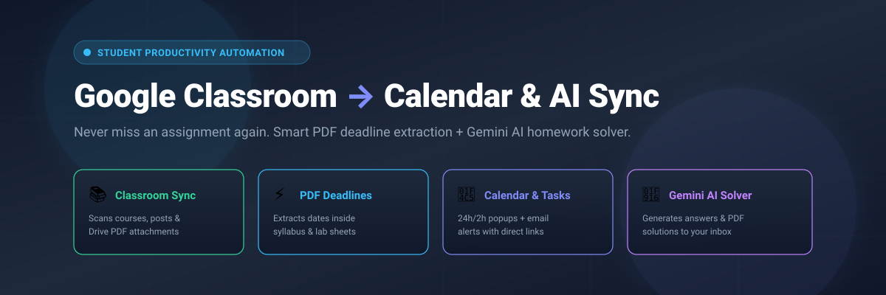
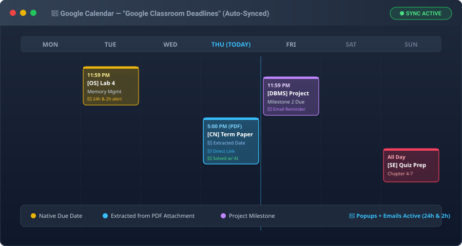
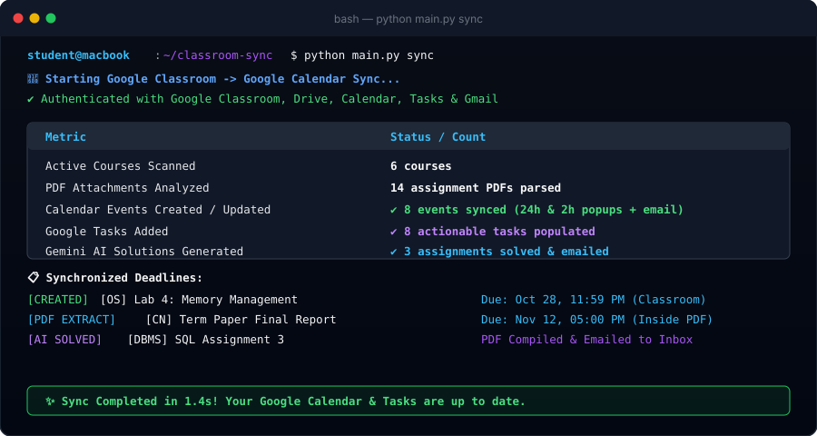
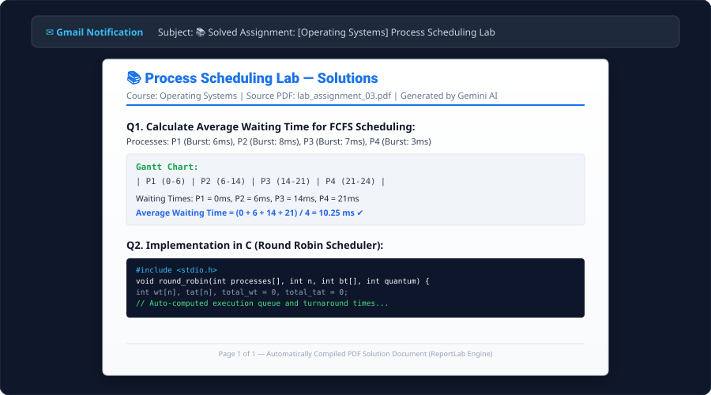

<div align="center">



# 🎓 Google Classroom to Google Calendar & AI Automation

**The ultimate student productivity assistant. Never miss an assignment, project milestone, or PDF deadline again.**

[](https://github.com/PurohitBhagyesh/classroom-to-calendar-sync/actions/workflows/ci.yml)
[](https://opensource.org/licenses/MIT)
[](https://www.python.org/downloads/)
[](https://developers.google.com/classroom)
[](https://developers.google.com/calendar)
[](https://aistudio.google.com/)

[Key Features](#-key-features) • [Why Students Love This](#-why-students-love-this) • [Quickstart Guide](#-quickstart-guide) • [Visual Demos](#-visual-previews--demos) • [CLI Commands](#-cli-commands--usage) • [macOS Daemon](#-macos-background-daemon) • [Contributing](#-contributing)

</div>

---

## 🎯 The Student Problem This Solves

> *"My professor posted a 10-page assignment PDF with the deadline buried on page 3 in tiny text, without setting an official Google Classroom due date. I missed the submission and lost 20% of my grade."*

**Does this sound familiar?**
- ❌ Professors frequently attach lab manuals, rubrics, and PDFs without filling in Classroom's native deadline field.
- ❌ Students have to manually click through 6+ different subjects every day to check for new announcements.
- ❌ Important project milestones (`"Milestone 1 due in 2 weeks"`) get lost in long PDFs.
- ❌ No automatic popup or email reminders when deadlines approach.

### 💡 The Automated Solution:
This tool scans all your enrolled courses, downloads assignment PDFs, extracts hidden submission dates using NLP & Regex, schedules events in **Google Calendar** with **24h & 2h popups + email notifications**, adds actionable **Google Tasks**, and can even **solve assignment questions with Gemini AI** and email printable PDF answers straight to your inbox!

---

## ✨ Key Features

| Feature | Description |
| :--- | :--- |
| 🔄 **Classroom Auto-Scan** | Fetches assignments, coursework, announcements, and Google Drive attachments across all enrolled courses. |
| ⚡ **Smart PDF Deadline Parser** | Reads attached PDFs and extracts hidden dates (`"Submission: Oct 28 at 11:59 PM"`, `"Due by 15/11/2026"`). |
| 📅 **Google Calendar Sync** | Creates a dedicated `"Google Classroom Deadlines"` calendar with color coding and direct links. |
| 🔔 **Multi-Stage Reminders** | Configures both popup notifications and email reminders **24 hours** and **2 hours** before the deadline. |
| 📋 **Google Tasks Integration** | Automatically populates your Google Tasks checklist with due dates and direct assignment URLs. |
| 🤖 **Gemini AI Homework Solver** | (Optional) Analyzes assignment questions and generates step-by-step solutions with code and diagrams. |
| 📑 **Printable PDF Generator** | Converts AI solutions into clean, styled, ready-to-print PDF documents using ReportLab. |
| ✉️ **Gmail Dispatcher** | Delivers generated solution markdown and attached PDF reports directly to your Gmail inbox. |
| 🔄 **Smart Deduplication** | Uses SQLite database state tracking to prevent duplicate events and updates modified deadlines. |
| 🍎 **macOS Background Daemon** | Runs silently in the background at custom intervals (e.g. every 4 days) via Apple LaunchAgent. |

---

## 🖼️ Visual Previews & Demos

<!-- SCREENSHOT 1: GOOGLE CALENDAR PREVIEW -->
### 📅 1. Google Calendar & Multi-Stage Reminders
Events are automatically color-coded with direct assignment links, PDF attachment links, and context snippets.



<br/>

<!-- SCREENSHOT 2: TERMINAL CLI OUTPUT -->
### 💻 2. Rich Interactive Terminal Dashboard
Clean CLI interface powered by `Rich` showing scanned courses, analyzed PDFs, created events, and AI solutions.



<br/>

<!-- SCREENSHOT 3: GEMINI AI SOLUTIONS PDF -->
### 📝 3. AI-Generated Solution Document (PDF & Email)
Step-by-step solved homework answers formatted into a printable PDF and emailed to your inbox.



> 💡 *To replace these with your own custom screenshots, drop PNG images into [`assets/`](assets/) (see [Assets Guide](assets/README.md)).*


---

## 🏗️ Architecture & Workflow

```
                        ┌─────────────────────────────────────┐
                        │       Google Classroom API          │
                        │  (Courses, Assignments, Drive PDFs) │
                        └──────────────────┬──────────────────┘
                                           │
                                           ▼
                        ┌─────────────────────────────────────┐
                        │      PDF Deadline Extractor         │
                        │  (Regex + NLP Submission Detection) │
                        └──────────────────┬──────────────────┘
                                           │
                ┌──────────────────────────┴──────────────────────────┐
                ▼                                                     ▼
┌───────────────────────────────┐                     ┌───────────────────────────────┐
│     Google Calendar API       │                     │       Google Tasks API        │
│ • "Google Classroom Deadlines"│                     │ • Actionable To-Do Checklists │
│ • 24h & 2h Popups + Emails    │                     │ • Direct Link Attachments     │
└───────────────┬───────────────┘                     └───────────────────────────────┘
                │
                ▼
┌───────────────────────────────┐
│     Gemini AI Solver          │  (Optional: Solves questions step-by-step)
└───────────────┬───────────────┘
                │
        ┌───────┴─────────────────────────────┐
        ▼                                     ▼
┌───────────────────────────────┐     ┌───────────────────────────────┐
│     ReportLab PDF Builder     │     │      Gmail API Dispatcher     │
│ • Formats & Compiles Solution │     │ • Delivers markdown & PDF to  │
│   PDF Document                │     │   your Gmail inbox            │
└───────────────────────────────┘     └───────────────────────────────┘
```

---

## 🚀 Quickstart Guide

### 1. Prerequisites
- Python 3.10 or higher
- A Google Account (student or personal)
- A Google Cloud Project with OAuth 2.0 Desktop Credentials ([Step-by-Step Setup Guide](#-google-cloud-credentials-setup))

### 2. Clone the Repository
```bash
git clone https://github.com/PurohitBhagyesh/classroom-to-calendar-sync.git
cd classroom-to-calendar-sync
```

### 3. Create & Activate Virtual Environment
```bash
python3 -m venv .venv
source .venv/bin/activate
pip install -r requirements.txt
```

### 4. Setup Google Credentials
1. Follow the [Google Cloud Setup Guide](#-google-cloud-credentials-setup) below to download your `credentials.json`.
2. Place `credentials.json` in the root folder:
   ```bash
   cp ~/Downloads/client_secret_*.json ./credentials.json
   ```

### 5. Configure Optional Settings (`.env`)
```bash
cp .env.example .env
```
Edit `.env` (optional):
```env
# Optional: Add your Gemini API Key to enable AI homework solving
GEMINI_API_KEY=your_gemini_api_key_here

# Optional: Add recipient email to receive AI PDF solutions
RECIPIENT_EMAIL=your_email@example.com

# Optional: Fallback timezone (e.g., "Asia/Kolkata", "America/New_York", "auto")
SYNC_TIMEZONE=auto
```

### 6. Authenticate & Connect
Run the setup command to log in with your Google account via browser:
```bash
python main.py setup
```
*A browser tab will open asking you to allow Calendar, Classroom, Drive, and Tasks permissions. Once approved, you are ready to sync!*

---

## 🔑 Google Cloud Credentials Setup

1. Go to the [Google Cloud Console](https://console.cloud.google.com/).
2. Click **Create Project** (e.g. `Classroom-Sync`).
3. Under **APIs & Services > Library**, search for and enable:
   - ✅ **Google Classroom API**
   - ✅ **Google Drive API**
   - ✅ **Google Calendar API**
   - ✅ **Google Tasks API**
   - ✅ **Gmail API** *(Optional, for email dispatching)*
4. Under **APIs & Services > OAuth consent screen**:
   - Select **External** and click **Create**.
   - Enter an App Name (e.g. `Classroom Sync`) and your email address.
   - Under **Test Users**, add your Google email address.
5. Under **APIs & Services > Credentials**:
   - Click **Create Credentials > OAuth client ID**.
   - Application Type: **Desktop app**.
   - Name: `Classroom Desktop Sync`.
   - Click **Create**, then click **Download JSON**.
   - Rename downloaded file to `credentials.json` and move it to the project root.

---

## 💻 CLI Commands & Usage

### 🔄 1. Run Synchronization
```bash
# Sync all courses from the last 30 days
python main.py sync

# Dry-run mode (preview without making changes to Google Calendar)
python main.py sync --dry-run

# Filter by course name (e.g., only "Operating Systems")
python main.py sync --filter "Operating Systems"

# Force update all existing calendar entries
python main.py sync --force
```

### ⏱️ 2. Continuous Watch Daemon
```bash
# Automatically scan for new assignments every 30 minutes
python main.py watch --interval 30
```

### 🧪 3. Test PDF Deadline Extraction Locally
```bash
# Test date/time extraction on any syllabus or assignment PDF
python main.py test-pdf path/to/assignment_sheet.pdf
```

### 🤖 4. Solve Assignment with Gemini AI
```bash
# Solve questions in a PDF, compile a solution document, and email it
python main.py solve path/to/lab_manual.pdf \
    --course "Computer Networks" \
    --title "Subnetting Assignment" \
    --email "student@university.edu"
```

### 📊 5. View Local Sync State & Database
```bash
# View all synchronized assignments and their linked Google Calendar IDs
python main.py status
```

---

## 🍎 macOS Background Daemon

Want the sync to run completely automatically in the background on your Mac?

```bash
# Make the helper script executable
chmod +x run.sh

# Install background daemon (runs automatically every 4 days)
./run.sh autostart

# Check sync status
./run.sh status

# Stop and uninstall background daemon
./run.sh stop-autostart
```

---

## 🧪 Running Tests

Run the complete unit and integration test suite:

```bash
pytest -v
```

---

## 📁 Project Structure

```
classroom-to-calendar-sync/
├── assets/                        # Banners, screenshots, and visual guides
│   ├── banner.svg
│   └── README.md
├── .github/
│   └── workflows/
│       └── ci.yml                 # Automated CI/CD test pipeline
├── config.py                      # Scopes, reminder defaults, and settings
├── auth.py                        # OAuth 2.0 authentication manager
├── classroom_client.py            # Google Classroom & Drive API wrapper
├── calendar_client.py             # Google Calendar manager & reminder creator
├── tasks_client.py                # Google Tasks list & task sync client
├── pdf_extractor.py               # Regex + NLP PDF date/time parsing engine
├── gemini_solver.py               # Gemini AI assignment solver
├── pdf_generator.py               # ReportLab styled solution PDF builder
├── email_dispatcher.py            # Gmail API solution dispatcher
├── sync_manager.py                # Pipeline orchestrator & SQLite state store
├── main.py                        # Rich CLI entrypoint
├── run.sh                         # Automation runner & LaunchAgent manager
├── requirements.txt               # Dependencies
├── pytest.ini                     # Pytest configuration
├── tests/                         # Automated test suite (13 passing tests)
│   ├── test_clients.py
│   ├── test_pdf_extractor.py
│   └── test_sync_manager.py
├── .env.example                   # Environment configuration template
├── credentials.example.json       # OAuth client credentials template
├── .gitignore                     # Protection for tokens, keys & databases
├── LICENSE                        # MIT License (Unrestricted permissions)
├── CONTRIBUTING.md                # Contribution guide
└── SECURITY.md                    # Security policy
```

---

## 🔒 Privacy & Security

- 🛡️ **Zero Third-Party Servers**: Runs 100% locally on your machine.
- 🔑 **Secure Token Storage**: Your OAuth tokens and `credentials.json` are strictly stored in your local workspace and ignored by git.
- 🌐 **Direct Google HTTPS**: All requests communicate directly with official Google APIs.

---

## 🤝 Contributing

Contributions are welcome! Whether it's adding new PDF date patterns, improving AI prompts, or adding new integrations:

1. Fork the Project (`https://github.com/PurohitBhagyesh/classroom-to-calendar-sync`)
2. Create your Feature Branch (`git checkout -b feature/AmazingFeature`)
3. Commit your Changes (`git commit -m 'Add some AmazingFeature'`)
4. Push to the Branch (`git push origin feature/AmazingFeature`)
5. Open a Pull Request

See [CONTRIBUTING.md](CONTRIBUTING.md) for detailed guidelines.

---

## 📄 License

Distributed under the **MIT License**. Free for students, educators, and developers to use, customize, and build upon. See [LICENSE](LICENSE) for more information.

<div align="center">
  <b>Built with ❤️ to help students stay ahead of their deadlines.</b><br/>
  ⭐ <i>If this helped you manage your coursework, give it a star on GitHub!</i>
</div>
